# 디스크 읽기 방식

데이터베이스의 성능 튜닝은 어떻게 디스크 I/O를 줄이느냐가 관건일 때가 많다.

컴퓨터나 CPU나 메모리 같은 주요 장치는 대부분 전자식 장치지만 하드 디스크 드라이브는 기계식 장치다.
그래서 디비 서버에서는 항상 디스크 장치가 병목이 된다.

순차 I/O에서는 SSD가 하드 디스크 드라이브보다 조금 빠르거나 비슷한 성능을 보여준다.
하지만 랜덤 I/O에서는 하드 디스크 드라이브보다 SSD가 훨씬 빠르다.
디비 서버에서는 순차 I/O 작업 보다 랜덤 I/O를 통해 작은 데이터를 읽고 쓰는 작업이 대부분이므로 SSD가 DBMS에 최적이다.

일반적인 웹 서비스 환경은 데이터베이스에서는 SSD가 하드 디스크 드라이브보다는 훨씬 빠르다.

디스크의 성능은 디스크 헤더의 위치 이동 없이 얼마나 많은 데이터를 한 번에 기록하느냐에 의해 결정된다고 볼 수 있다.
그래서 여러 번 쓰기 또는 읽기를 요청하는 랜덤 I/O자겅ㅂ이 작업 부하가 훨씬 크다.
디비 대부분의 작업 이러한 작은 데이터를 빈번히 읽고 쓰기 때문에 MYSQL 서버에는 그룹 커밋이나 바이너리 로그 버퍼 또는 InnoDB 로그 버퍼 등의 기능이 내장되어 있다.

사실 쿼리를 튜닝해서 랜덤 I/O를 순차 I/O로 바꿔서 실행할 방법은 그다지 많지 않다.
일반적으로 쿼리를 튜닝하는 것은 랜덤 I/O 자체를 줄여주는 것이 목적이라고 할 수 있다.
여기서 랜덤 I/O를 줄인다는 것은 쿼리를 처리하는 데 꼭 필요한 데이터만 읽도록 쿼리를 개선하는 것을 의미한다.

# 인덱스란?

DBMS도 데이터베이스 테이블의 모든 데이터를 검색해서 원하는 결과를 가져오려면 시간이 오래 걸린다.
그래서 칼럼의 값과 해당 레코드가 저장된 주소를 키와 쌍으로 삼아 인덱스를 만들어 둔다.
그리고 칼럼의 값을 주어진 순서로 미리 정렬해서 보관한다.

DBMS에 인덱스가 많은 테이블은 당연히 INSERT, UPDATE, DELETE 문장의 처리가 느려진다.
하지만 이미 정렬된 인덱스를 가지고 있기에 SELECT 문장은 빠르게 처리할 수 있다.

이처럼 테이블의 인덱스를 하나 더 추가할지 말지는 데이터의 저장 속도를 어디까지 희생할 수 있는지, 읽기 속도를 얼마나 더 빠르게 만들어야 하느냐에 따라 결정해야 한다.

인덱스는 데이터를 관리하는 방식과 중복 값의 허용 여부에 따라 여러 가지로 나눠볼 수 있다.

- 역할별로 구분하기
  - 프라이머리 키와 보조키 (세컨터리 인덱스)로 구분 할 수 있다.
- 데이터 저장 방식별로 구분하기
  - 대표적으로 B-Tree 인덱스와 Hash 인덱스로 구분할 수 있다.
- 데이터의 중복 허용 여부로 분류하기
  - 유니크 인덱스와 유니크하지 않은 인덱스로 구분할 수 있다.
- 인덱스의 기능별로 분류
  - 전문 검색용 인덱스나 공간 검색용 인덱스

# B-Tree 인덱스

B는 Balanced를 의미
칼럼의 원래 값을 변형시키지 않고 인덱스 구조체 내에서 한상 정렬된 상태로 유지한다.

## 구조 및 특성

디비에서 인덱스와 실제 데이터가 저장된 데이터는 따로 관리되는데, 인덱스의 리프 노드는 항상 실제 데이터 레코드를 찾아가기 위한 주소값을 가지고 있다
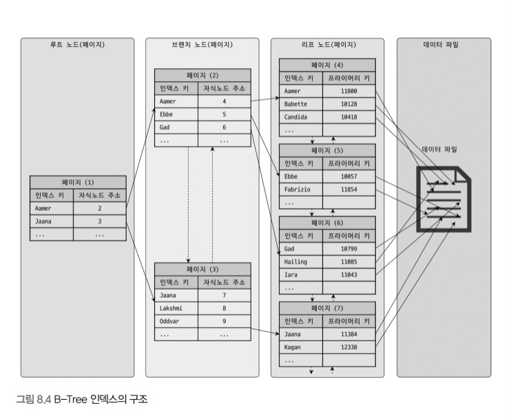
B-tree 인덱스의 각 노드와 데이터 파일의 관계
인덱스의 키 값은 모두 정렬돼 있지만, 데이터 파일의 레코드는 정렬돼 있지 않고 임의의 순서로 저장돼 있다.

인덱스는 테이블의 키 칼럼만 가지고 있으므로 나머지 칼럼을 읽으려면 데이터 파일에서 해당 레코드를 찾아야 한다.
이를 위해 인덱스의 리프 노드는 데이터 파일에 저장된 레코드의 주소를 가진다.

MyISAM 테이블의 인덱스와 데이터 파일의 관계
레코드 주소는 MyISAM 테이블의 생성 옵션에 따라 레코드가 테이블에 INSERT된 순번이거나 데이터 파일 내의 위치다.

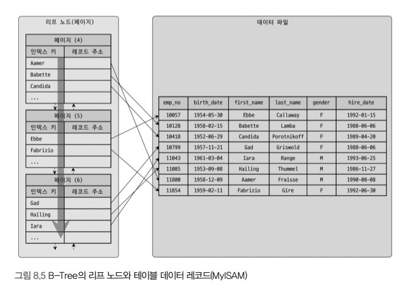

InnoDB 테이블의 인덱스의 데이터 파일의 관계
InnoDB 스토리지 엔진을 사용하는 테이블에서는 프라이머리 키가 ROWID의 역할을 한다.
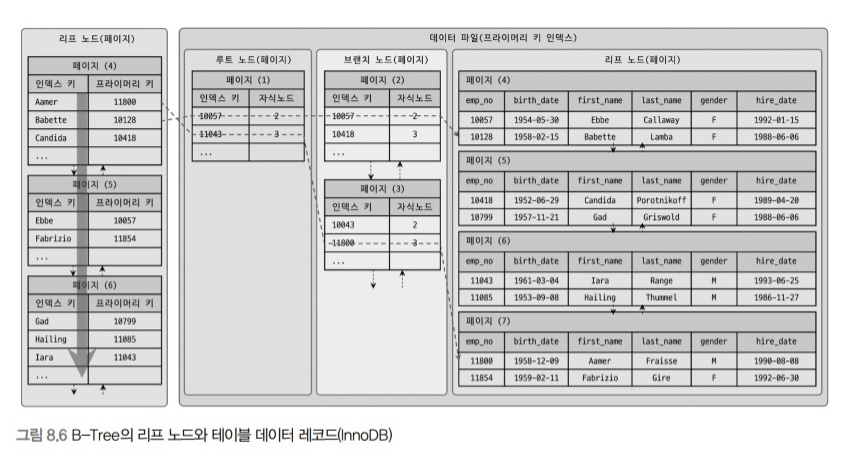

두 스토리지 엔진의 인덱스에서 가장 큰 차이점은 세컨더리 인덱스를 통해 데이터 파일의 레코드를 찾아가는 방법이 있다.
MyISAM 테이블은 세컨더리 인덱스가 물리적인 주소를 가지는 반면 InnoDB 테이블은 프라이머리 키를 주소처럼 사용하기 때문에 논리적인 주소를 가진다고 볼 수 있다.
그래서 InnoDB 테이블에서 인덱스를 통해 레코드를 읽을 때는 데이터 파일을 바로 찾아가지 못한다.
인덱스에 저장돼 있는 프라이머리 키 값을 이용해 프라이머리 키 인덱스를 한 번 더 검색한 후, 프라이머리 키 인덱스의 리프 페이지에 저장돼 있는 레코드를 읽는다.
즉, InnoDB 스토리지 엔진에서는 모든 세컨더리 인덱스 검색에서 데이터 레코드를 읽기 위해서는 반드시 프라이머리 키를 저장하고 있는 B-Tree를 다시 한 번 검색해야한다.

## 인덱스 키 추가와 삭제

새로운 키 값이 B-Tree에 저장될 때 테이블의 스토리지 엔진에 따라 새로운 키 값이 즉시 인덱스에 저장될 수 있고 그렇지 않을 수 있다.
B-Tree에 저장될 키 값을 이용해 B-Tree 상의 적절한 위치를 검색해야한다. 저장될 위치가 결정되면 레코드의 키 값과 대상 레코드의 주소 정보를 B-Tree의 리프 노드에 저장한다.
리프 노드가 꽉 차서 더는 저장할 수 없을 때는 리프 노드가 분리돼야 하는데, 이는 상위 브랜치 노드까지 처리의 범위가 넓어진다.
이러한 작업 탓에 B-Tree는 상대적으로 쓰기 작업에 비용이 많이 드는 것으로 알려졌다.

### 인덱스 키 삭제

B-Tree의 키 값이 삭제되는 경우는 간단하다.
해당 키 값이 저장된 B-Tree의 리프 노드를 찾아서 그냥 삭제 마크만 하면 작업이 완료된다.
이렇게 삭제 마킹된 인덱스 키 공간은 계속 그래도 방치하거나 재활용할 수 있다.
인덱스 키 삭제로 인한 마킹 작업 또한 디스크 쓰기가 필요하므로 이 작업 역시 디스크 I/O가 필요한 작업이다.

### 인덱스 키 변경

인덱스의 키 값은 그 갑에 따라 저장될 리프 노드의 위치가 결정되므로 B-Tree의 키 값이 변경되는 경우에는 단순히 인덱스상의 키 값만 변경하는 것은 불가능하다.
B-Tree의 키 값 변경 작업은 먼저 키 값ㅇ르 삭제한 후, 다시 새로운 키 값을 추가하는 형태로 처리된다.
키 값의 변경 때문에 발생한느 B-Tree 인덱스 키 값의 삭제와 추가 작업은 앞에서 설명한 절차대로 처리된다.
결국 인덱스 키 값을 변경하는 작업은 기존 인덱스 키 값을 삭제한 후 새로운 인덱스 키 값을 추가하는 작업으로 처리되고, InnoDB 스토리지 엔진을 사용하는 테이블에서는
이 작업을 모두 체인지 버퍼를 활용해 지연 처리 될 수 있다.

### 인덱스 키 검색

INSERT, UPDATE, DELETE 작업을 할 때 인덱스 관리에 따르는 추가 비용을 감당하면서 인덱스를 구축하는 이유는 빠른 검색을 위해서이다.
인덱스를 검색하는 작업은 B-Tree의 루트 노드부터 시작해 브랜치 노드를 거쳐 최종 리프 노드까지 이동하면서 비교 작업을 수행하는데, 이 과정을 트리 탐색이라고 한다.
인덱스 트리 탐색은 SLECT에서만 사용하는 것이 아니라 UPDATE DELETE를 처리하기 위해 해당 레코드를 검색할 때에도 사용된다.

B-Tree 인덱스를 이용한 검색은 100% 일치 또는 값의 앞부분만 일치하는 경우에 사용할 수 있다.
부등호 비교 조건에서도 인덱스를 활용할 수 있지만, 인덱스를 구성한느 키 값의 뒷부분만 검색하는 용도로는 인덱스를 사용할 수 없다.
또한 인덱스를 이용한 검색에서 중요한 사실은 인덱스의 키 값에 변형이 가해진 후 비교되는 경우에는 절대 B-Tree의 빠른 검색 기능을 사용할 수 없다.

이미 변형된 값은 B-Tree인덱스에 존재하는 값이 아니다.
따라서 함수나 연산을 수행한 결과로 정렬한다거나 검색하는 작업은 B-Tree의 장점을 이용할 수 없으므로 주의해야한다.

## B-Tree 인덱스 사용에 영향을 미치는 요소

인덱스를 구성하는 칼럼의 크기와 레코드의 건수, 그리고 유니크한 인덱스 키 값의 개수 등에 의해 검색이나 변경 작업의 성능이 영향을 받는다.

### 인덱스 키 값의 크기

인덱스는 페이지 단위로 관리된다.
B-Tree의 자식 노드의 개수는 가변적이다.
몇 개까지 가지고 있느냐? 그건 인덱스의 페이지 크기와 키 값의 크기에 따라 결정된다.

인덱스의 키가 16바이트라고 가정하면 다음 그림과 같이 인덱스 페이지가 구성된다.
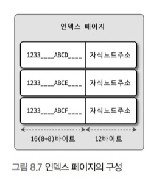
그림같은 경우 하나의 인덱스 페이지에 16*1024/(16+12) = 585개 저장할 수 있다.
그럼 2배인 32바트일 경우는 16*1024/(32+12) = 372개 저장 할 수 있다.

SELECT 쿼리가 레코드 500개를 읽어야 한다면 전자는 인덱스 페이지 한 번으로 해결될 수 있지만, 후자는 최소한 2번 이상 디스크로부터 읽어야 한다.
결국 인덱스를 구성하는 키 값의 크기가 커지면 디스크로부터 읽어야 하는 횟수가 늘어나고, 그만큼 느려진다는 것을 의미한다.

또한, 인덱스 키 값의 길이가 길어진다는 것은 전체적인 인덱스의 크기가 커진다는 것을 의미한다.
레코드를 위한 인덱스 크기가 커질 수록 메모리에 캐시해 둘 수 있는 레코드 수는 줄어든다.
그렇게 되면 자연히 메모리의 효율이 떨어지는 결과를 가져온다.

### B-Tree 깊이

인덱스 키 값의 크기가 커질수록 하나의 인덱스 페이지가 담을 수 있는 인덱스 키 값의 갯수가 적어지고, 그 때문에 같은 레코드 건수라도 B-Tree의 깊이가 깊어져서 디스크 읽기가 더 많이 필요하게 된다.

### 선택도

모든 인덱스 키 값 가운데 유니크한 값의 수를 의미한다.
전체 인덱스 키 값은 100개인데, 그중에서 유니크한 값의 수는 10개면 기수성은 10이다.
인덱스 키 값 가운데 중복된 값이 많아지면 기수성은 낮아지고 동시에 선택도 또한 떨어진다.
인덱슨느 선택도가 높을수록 검색 대상이 줄어들기 때문에 빠르게 처리된다.

tb_city 테이블에는 1만 건의 레코드를 가지고 있다.
인덱스는 country에만 걸려있음

SELECT \*
FROM tb_city
WHERE country='KOREA' AND city='SEOUL'

1. country 칼럼의 유니크 값이 10개 일때
   country='KOREA' 조건으로 검색했을 때 (10000/10)이 일치하리라는 것을 예상할 수 있다.
   그런데 인덱스 통해 검색된 1000건 가운데 city='SEOUL'인 레코드는 1건이므로 999건은 불필요하게 읽은 것으로 간주

2. 1000개 일때
   country='KOREA' 조건으로 검색했을 때 (10000/1000)이 일치하리라는 것을 예상할 수 있다.
   그런데 인덱스 통해 검색된 10건 가운데 city='SEOUL'인 레코드는 1건이므로 9건은 불필요하게 읽은 것으로 간주

두 케이스의 테이블에서 똑같은 쿼릴르 실행해 똑같은 결과를 받았지만, 두 쿼리가 처리되기 위해 MYSQL 서버가 수행한 작업 내용은 매우 크다는 것을 알 수 있다.
이처럼 인덱스에서 유니크한 값의 개수는 인덱스나 쿼리의 효율성에 큰 여향을 미친다.

### 읽어야 하는 레코드의 건수

인덱스를 통해 테이블의 레코드를 읽는 것은 인덱스를 거치지 않았을 때보다 높은 비용이 드는 작업이다.

일반적으로 DBMS의 옵티마이저에서는 인덱스를 통해 레코드 1건을 읽는 것이 테이블에서 직접 레코드 1건을 읽는 것보다 4~5배 정도 비용이 더 많이 드는 작업인 것으로 예측한다.
즉, 인덱스를 통해 읽어야 할 레코드의 건수가 전체 테이블 레코드의 20~25%를 넘어서면 인덱스를 이용하지 않고 테이블을 모두 직접읽어 필터링 하는 방식으로 처리하는 것이 효율적이다.

## B-tree 인덱스를 통한 데이터 읽기

어떤 경우에 인덱스를 사용하게 유도할지, 또는 사용하지 못하게 할지 판단하려면 MySQL이 어떻게 인덱스를 이용해서 실제 레코드를 읽어 내는지 알아야한다.

### 인덱스 레인지 스캔

대표적인 인덱스의 접근 방법
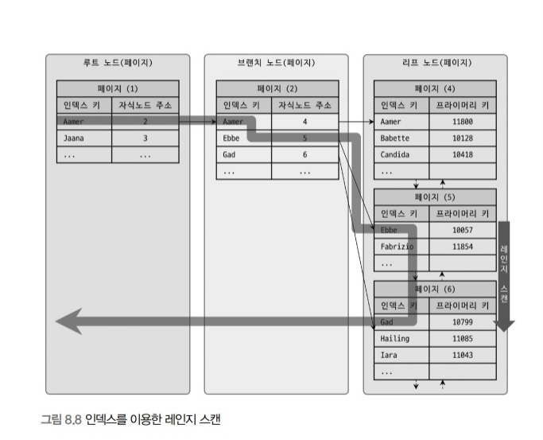
검색해야할 인덱스의 범위가 결정됐을 때 사용하는 방식이다.
검색하려는 값의 수나 검색 레코드 건수와 관계 없이 레인지 스캔이라고 표현한다.
루트 노드에서부터 비교를 시작해 브랜치 노드를 거치고 최종적으로 리프 노트까지 찾아 들어가야만 비로소 필요한 레코드의 시작 지점을 찾을 수 있다.
일단 시작해야 할 위치를 찾으면 그때부터는 리프 노드의 레코드 순서대로 읽으면 된다.
이처럼 차례대로 쭉 읽는 것을 스캔이라고 표현한다.

만약 스캔하다가 리프 노드의 끝까지 읽으면 리프 노드 간의 링크를 이용해 다음 리프 노드를 찾아서 다시 스캔한다.
그리고 최종적으로 스캔을 멈춰야 할 위치에 다다르면 지금까지 읽은 레코드를 사용자에게 반환하고 쿼리를 끝낸다.

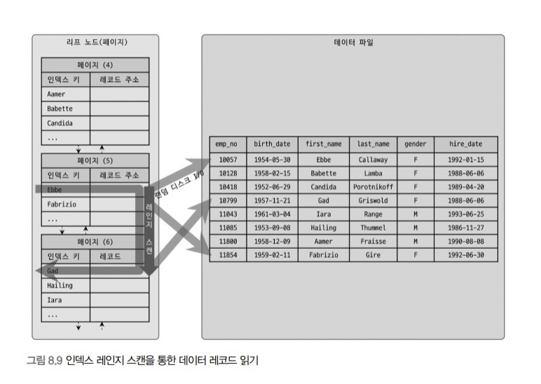
B-Tree 인덱스에서 루트와 브랜치 노드를 이용해 스캔 시작 위치를 검색하고, 그 지점부터 필요한 방향으로 인덱스를 읽어 나가는 과정 나타냄

어떤 방식으로 스캔하든 관계없이, 해당 인덱스를 구성한느 칼럼의 정순 또는 역순으로 정렬된 상태로 레코드를 가져온다는 것이다.

인덱스의 리프 노드에서 검색 조건에 일치하는 건들은 데이터 파일에서 레코드를 읽어오는 과정이 필요하다는 것이다.
이때 리프 노드에 저장된 레코드 주소로 데이터 파일의 레코드를 읽어오는데, 레코드 한 건 단위로 랜던 I/O가 일어난다.

그래서 인덱스를 통해 데이터 레코드르 읽는 작업은 비용이 많이 드는 작업으로 분류된다.
그리고 인덱스를 통해 읽어야 할 데이터 레코드가 20~25%를 넘으면 인덱스를 통한 읽기보다
테이블의 데이터를 직접 읽는 것이 더 효율적인 처리 방식이 된다.

인덱스 레인지 스캔은 다음과 같이 크게 3단계를 거친다.

1. 인덱스에서 조건을 만족하는 값이 저장된 위치를 찾는다. 이 과정을 인덱스 탐색이라고 한다.
2. 1번에서 탐색된 위치부터 필요한 만큼 인덱스를 차례대로 쭉 읽는다. 이 과정을 인덱스 스캔이라고 한다.
3. 2번에서 읽어 들인 인덱스 키와 레코드 주소를 이용해 레코드가 저장된 페이지를 가져오고, 최종 레코드를 읽어온다.

### 인덱스 풀 스캔

인덱스 스캔과 달리 인덱스의 처음부터 끝까지 모두 읽는 방식을 인덱스 풀 스캔이라고 한다.
대표적으로 쿼리의 조건절에 사용된 칼럼이 인덱스의 첫 번째 칼럼이 아닌 경우 인덱스 풀 스캔 방식이 사용된다.

인덱스의 크기는 테이블의 크기보다 작으므로 직접 테이블을 처음부터 끝까지 읽는 것보다 인덱스만 읽는 것이 효율적이다.
쿼리가 인덱스에 명시된 칼럼만으로 조건을 처리할 수 있는 경우 주로 이 방식이 사용된다.
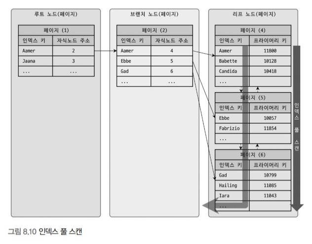

인덱스 리프 노드의 제일 앞 또는 제일 뒤로 이동한 후, 인덱스의 리프 노드를 연결하는 링크드 리스트를 따라서 처음부터 끝까지 스캔하는 방식을 인덱스 풀 스캔이라고 한다.
인덱스 레인지 스캔보다 빠르지 않지만 테이블 풀 스캔보다는 효율적이다.

인데스에 포함된 칼럼만으로 쿼리를 처리할 수 있는 경우 테이블 레코드를 읽을 필요가 없기 때문이다.

### 루스 인덱스 스캔

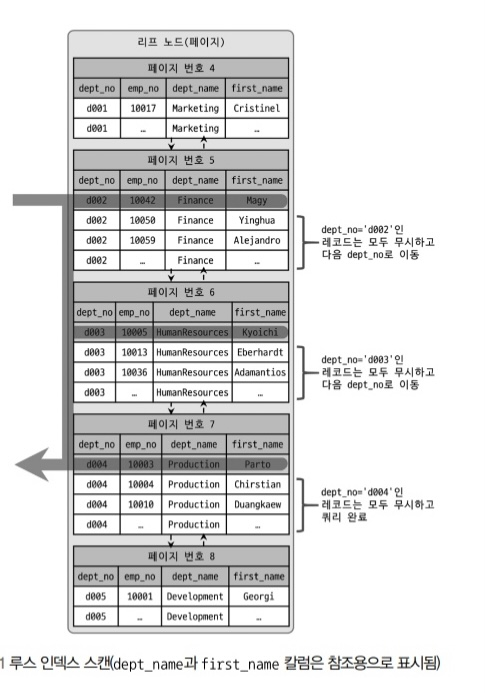
 
말 그대로 느슨하게 또는 듬성듬성하게 인덱스를 읽는 것을 의미한다.
인덱스 레인지 스캔과 비슷하게 작동하지만 중간에 필요치 않은 인덱스 키 값은 무시하고 다음으로 넘어가는 형태로 처리한다.
GROUP BY 또는 집합 함수 가운데 MAX, MIN 함수에 대해 최적화를 하는 경우에 사용된다.
인덱스 리프 노드를 스캔하면서 불필요한 부분은 무시하고 필요한 부분만 읽는것을 볼 수 있다.

### 인덱스 스킵 스캔

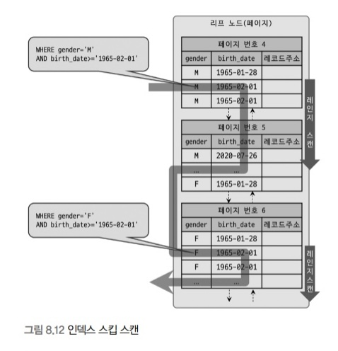
루스 인덱스 스캔은 GROUPY BY 작업을 처리하기 위해 인덱스를 사용하는 경우에만 적용할 수 있었지만 8.0버전에 도입된 인덱스 스킵 스캔은 WHERE 조건절의 검색을 위해 사용가능 하도록 용도가 훨씬 넓어짐
다중 칼럼 인덱스가 생성되어있다면 후행 칼럼만으로는 인덱스 사용이 불가능했지만(선행 칼럼만으로는 인덱스 사용이 가능) 인덱스 스킵 스캔을 통해 후행 칼럼만으로도 인덱스 사용이 가능해짐
MySQL의 옵티마이저는 각 선행 값에 대해 레인지 스캔을 반복적으로 수행하는 형태의 최적화를 실행하게 됨
단, 아직 8.0 버전에 새롭게 도입된 기능인만큼 WHERE 조건절에 조건이 없는 인덱스의 선행 칼럼의 유니크한 값의 개수가 적어야 하고 쿼리가 인덱스에 존재하는 칼럼만으로 처리가 가능한 커버링 인덱스여야 한다는 제약 조건이 있음
선행 칼럼의 유니크한 값의 개수가 많다면 쿼리 성능이 매우 떨어짐
나머지 칼럼 값이 필요하다면 결국 풀 테이블 스캔으로 실행 계획을 수립함

## 다중 칼럼 인덱스

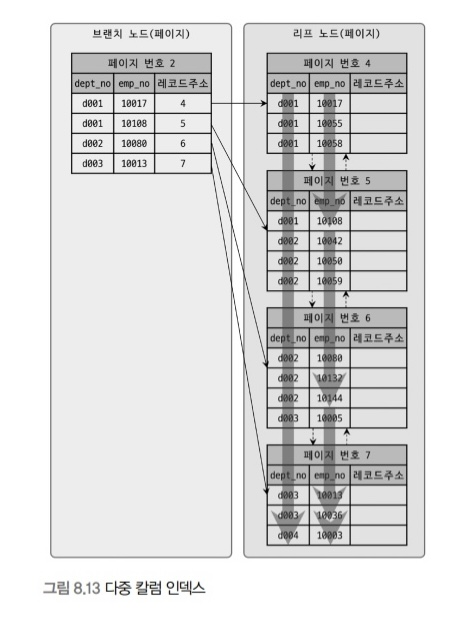
2개 이상의 칼럼을 포함하는 인덱스
정렬이 앞쪽 순서의 칼럼에 의존적이다.
다중 컬럼 인덱스에서는 인덱스 내에서 각 칼럼의 위치가 중요

## B-Tree 인덱스의 정렬 및 스캔 방향

인데스를 어느 방향으로 읽을지는 쿼리에 따라 옵티마이저가 실시간으로 만들어내는 실행 계획에 따라 결정된다.

### 인덱스의 정렬

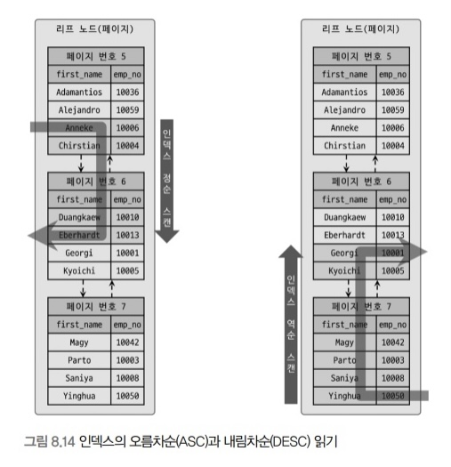
일반적인 상용 DBMS에서는 인덱스를 생성하는 시점에 인덱스를 구성하는 각 칼럼의 정렬을 오름차순 또는 내림차순으로 설정할 수 있음
5.7버전까지는 칼럼 단위로 정렬 순서를 혼합해서 인덱스를 생성할 수 없어 숫자 칼럼의 경우 -1을 곱한 값을 저장하는 우회 방법을 사용했었음(에러 없이 인덱스를 생성하긴 하나 모두 오름차순 정렬로만 실제론 생성됐음)
8.0버전부터는 혼합해서 사용 가능
인덱스가 정렬되어 있는 방향은 고정되어 있더라도 옵티마이저는 읽는 방향의 전환을 통해 시점에 따라 정렬되는 듯한 효과를 얻을 수 있음(단, 2개 이상의 칼럼이 내림차순과 오름차순을 동시에 사용한다면 각 칼럼이 오름차순, 내림차순으로 정의된 복합 칼럼 인덱스가 필요함)
다음 이유로 인해 역순 정렬 쿼리가 정순 정렬 쿼리보다 더 오래 걸림
페이지 잠금이 인덱스 정순 스캔에 더 적합한 구조
페이지 내에서 인덱스 레코드가 단방향으로만 연결된 구조
자주 사용되는 정렬 순서대로 인덱스를 생성하는 것이 잠금 병목 현상을 완화하는데 도움을 줌
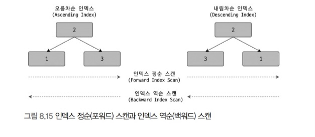
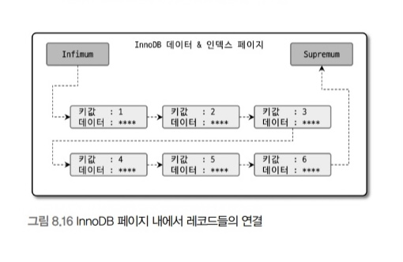

## B-Tree 인덱스의 기용성과 효율성

### 비교 조건의 종류와 효율성

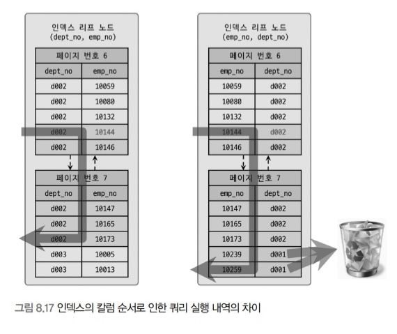
다중 칼럼 인덱스에서 각 칼럼의 순서와 그 칼럼에 사용된 조건이 크다, 작다, 같다 등의 범위 조건인지에 따라 인덱스 칼럼의 활용 형태가 달라지고 효율이 달라짐
필터링: 인덱스를 통해 읽은 레코드가 나머지 조건에 맞는지 비교하면서 취사선택하는 작업
작업 범위 결정 조건은 작업 자체의 범위를 결정하는 조건이고 필터링 조건은 작업 범위 자체는 줄이지 못하고 취사선택하는데만 이용됨 -> 작업 범위 결정 조건은 많아질 수록 쿼리의 처리 성능을 높이지만 필터링 조건은 오히려 쿼리 실행을 더 느리게 만드는 경우가 많음

### 인덱스의 가용성

B-Tree 인덱스의 특징은 왼쪽 값에 기준해서 오른쪽 값이 정렬되어 있다는 것
하나의 칼럼으로 검색해도 왼쪽 부분이 없으면 인덱스 레인지 스캔 방식의 검색이 불가능하고 다중 칼럼 인덱스에서도 왼쪽 칼럼의 값을 모르면 인덱스 레인지 스캔을 사용할 수 없음

### 가용성과 효율성 판단

B-Tree 인덱스의 특성상 다음 값들은 작업 범위 결정 조건으로 사용 불가하고 경우에 따라 체크 조건으로 인덱스의 사용이 가능함
NOT-EQUAL로 비교된 경우
LIKE '%??' 형태로 문자열 패턴이 비교된 경우(앞부분이 아닌 뒷부분 일치로)
스토어드 함수(사용자 지정 함수)나 다른 연산자로 인덱스 칼럼이 변형된 후 비교된 경우
NOT-DETERMINISTIC 속성의 스토어드 함수(스토어드 함수를 실행했을 때 매번 결과가 달라지는 것)가 비교 조건에 사용된 경우
데이터 타입이 서로 다른 비교(인덱스 칼럼의 타입을 변환해야 비교가 가능한 경우)
문자열 데이터 타입의 콜레이션(문자 비교 및 정렬 방식)이 다른 경우
다른 일반적인 DBMS에서는 NULL 값이 인덱스에 저장되지 않지만 MySQL에서는 NULL 값도 인덱스에 저장됨
다중 컬럼의 다음 두 조건을 만족하는 경우(INDEX is_test ( column_1, column_2, column_3, ..., column_n)) column_1부터 column_i 까지는 작업 범위 결정 조건으로 사용되고 그 이후부터는 체크 조건으로 사용
작업 범위 결정 조건으로 인덱스를 사용하지 못하는 경우
column_1 칼럼에 대한 조건이 없는 경우
column_2 칼럼의 비교 조건이 위의 인덱스 사용 불가 조건 중 하나인 경우
작업 범위 결정 조건으로 인덱스를 사용하는 경우
column_1 ~ column(i-1) 칼럼까지 동등 비교 형태('=' 또는 'IN')로 비교
column_i 칼럼에 대해 다음 연산자 중 하나로 비교(동등 비교, 크다 작다 형태, LIKE로 좌측 일치 패턴)

# 전문 검색 인덱스

문서의 내용 전체를 인덱스화해서 특정 키워드가 포함된 문서를 검색하는 전문 검색에서는 일반용도의 B-Tree 인덱스를 사용할 수 없다.
그렇기에 전문화된 전문 검색 인덱스를 사용해야한다.

## 인덱스 알고리즘

전문 검색에서는 본문에서 사용자가 검색하게 될 키워드로 인덱스를 구축한다.
키워드 분석 및 인덱스 구축에는 다양한 방법이 있다.

### 어근 분석 알고리즘

1. 불용어 처리 : 가치없는 단어 필터링
2. 어근 분석 : 단어의 원형을 찾는 과정
   을 통해 색인 작업이 수행이된다.

### n-gram 알고리즘

단순히 키워드를 검색해내기 위한 인덱싱 알고리즘
본문을 몇 글자씩 잘라서 인덱싱하는 방법

## 전문 검색 인덱스의 가용성

인덱스를 사용하려면 두 조건을 만족해야한다.

1. 쿼리 문장이 전문 검색을 위한 문법을 사용
2. 테이블이 전문 검색 대상 칼럼에 대해서 전문 인덱스 보유

# 멀티 밸류 인덱스

하나의 데이터 레코드가 여러개의 키 값을 가질 수 있는 형태의 인덱스다.
JSON 타입 형태로 저장

# 클러스터링 인덱스

MYSQL 서버에서 클러스터링은 테이블의 레코드를 비슷한 것들끼리 묶어서 저장하는 형태로 구현

## 클러스터링 인덱스

테이블 프라이머리 키에 대해서만 적용되는 내용이다.
프라이머리 키 값이 비슷한 레코드끼리 묶어서 저장하는 것을 클러스터링 인덱스라고 표현한다.
프라이머리 키 값에 의해 레코드의 저장 위치가 결정된다.
클러스터링 인덱스와 클러스터링 테이블로 불림
키 기반의 검색이 매무 빠르나 레코드의 저장이나 프라이머리 키의 변경이 상대적으로 느리다.
구조 자체는 일반 B-Tree와 비슷하나 클러스터링 인덱스의 리프 노드에서는 레코드의 모든 칼럼이 같이 저장돼 있음

만약 프라이머리 키가 없는 InnoDB의 경우에는 다음 우선순위대로 키를 찾는다.

1. 프라이머리 키
2. NOT NULL 옵션의 유니크 인덱스 중에서 첫 번째 인덱스를 클러스터링 키로 선택
3. 자동으로 유니크한 값을 가지도록 증가되는 칼럼을 내부적으로 추가한 후, 클러스터링 키로 선택

## 세컨더리 인덱스에 미치는 영향

MyISAM이나 MEMORY 테이블와 같은 클러스터링되지 않는 테이블은 INSERT될 때 처음 저장된 공감에서 이동하지 않는다.
그래서 프라이머리 키나 세컨더리 인덱스의 각 키는 주소(ROWID)를 이용해 데이터 레코드를 가져오기에 구조적으로 차이가 없다.
InnoDB 테이블의 모든 세컨더리 인덱스는 해당 레코드가 저장된 주소가 아니라 프라이머리 키 값을 저장하도록 구현돼 있다.

## 클러스터링 인덱스의 장점과 단점

장점 (빠른 읽기)

- 프라이머리 키로 검색할 때 처리 성능이 빠름
- 테이블의 모든 세컨더리 인덱스가 프라이머리 키를 가지고 있기에 인덱스만으로 처리될 수 있는 경우가 많음

단점 (느린 쓰기)

- 클러스터링 키 값의 크기가 클 경우 전체적으로 인덱스의 크기가 커짐
- 세컨더리 인덱스를 통해 검색할 때 프라이머 키로 다시 한번 검색해야 하므로 처리 성능이 느림
- INSERT할 때 프라이머리 키에 의해 레코드의 저장 위치가 결정되기 때문에 처리 성능이 느림
- 프라이머리 키를 변결할 때 레코드를 DELETE하고 INSERT하는 작업이 필요하기 때문에 처리 성능이 느림

## 클러스터링 테이블 사용 시 주의사항

### 인덱스 키의 크기

클러스터링 테이블의 경우 모든 세컨더리 인덱스가 프라이머리 키 값을 포함한다.
그래서 프라이머리 키의 크기가 커지면 세컨더리 인덱스도 자동으로 크기가 커진다.

### 프라이머리 키는 AUTO-INCREMENT보다는 업무적인 칼럼으로 생성

InnoDB의 프라이머리 키는 클러스터링 키로 사용되며, 이 값에 의해 레코드의 위치가 결정된다.
프라이머리 키로 검색하는 경우 클러스터링되지 않은 테이블에 비해 빠르게 처리될 수 있음을 의미한다.
InnoDB에서는 큰 차이을 내기에 업무적으로 해당 레코드를 대표할 칼럼을 프라이머리 키로 설정하는 것이 좋다.

### 프라이머리 키는 반드시 명시할 것

AUTO-INCREMENT 칼럼을 이용해서라도 프라이머리 키는 생성하는 것을 권장
키를 정의하지 않으며 내부에서 자동으로 생성되는 키를 사용하는데 이는 사용자가 접근할 수 없다.
그렇기에 사용자가 사용할 수 있는 값을 프라이머리 키로 설정하는 것이 좋다.
또한 ROW 기반의 복제나 InnoDB Cluster에서는 모든 테이블이 프라이머리 키를 가져야만 하는 정상적인 복제 성능을 보장하므로 프라이머리 키를 설정하자

프라이머리 키를 대체하기 위해 인위적으로 추가된 키를 인조 식별자라고 한다. 로그 테이블과 같이 조회보다는 INSERT 위주의 테이블은 AUTO-INCREMENT를 이용한 인조 식별자를 프라이머리 키로 설정한느 것이
성능 향상에 도움이 된다.

# 유니크 인덱스

## 유나크 인덱스와 일반 세컨더리 인덱스의 비교

유니크 인덱스와 일반 세컨더리 인덱스는 구조상 차이점이 없지만 성능 관점에서 살펴보자

### 인덱스 읽기

1개의 레코드를 읽느냐 2개 이상의 레코드를 읽느냐의 차이만 있을뿐 레코드 건수가 같다면 성능상 차이는 미미하다.

## 인덱스 쓰기

유니크 인덱스의 키 값을 쓸 때는 중복된 값이 있는지 없는지 체크하는 과정이 한 단계 더 필요하다
그래서 유니크하지 않은 세컨더리 인덱스의 쓰기보다 느리다.
MYSQL에서는 유닉크 인덱스에서 중복된 값을 체크할 때는 읽기 잠금을 사용하고, 쓰기를 할 때는 쓰기 잠금을 사용하는데 이 과정에서 데드락이 빈번히 발생한다.

## 사용시 주의사항

유일성이 보장돼야하는 칼럼에 대해서는 유니크 인덱스를 생성하디, 필요하지 않다면 유니크 인덱스보다는 유니크하지 않은 세컨더리 인덱스를 생성하는 방법을 고려

# 외래키

외래키 제약이 설정되면 자동으로 연관되는 테이블의 칼럼에 인덱스까지 생성된다.
외래키가 제거되지 않은 상태에서는 자동으로 생성된 인덱스를 삭제할 수 없다.

InnoDB의 외래키 관리에는 두 가지 특징이 있다

- 테이블의 변경이 발생하는 경우에만 잠금 경합이 발생한다.
- 외래키와 연관되지 않은 칼럼의 변경은 최대한 잠금 경합을 발생시키지 않는다.

## 자식 테이블의 변경이 대기하는 경우

자식 테이블의 외래 키 칼럼의 변경은 부모 테이블의 확인이 필요한데, 이 상태에서 부모 테이블의 해당 레코드가 쓰기 잠금이 걸려 있으면 해당 쓰기 잠금이 해제될 때까지 기다리게 되는 것이다.
자식 테이블의 외래키가 아닌 칼럼의 변경은 외래키로 인한 잠금 확장이 발생하지 않는다.

디비에서 외래 키를 물리적으로 생성하려면 이러한 현상으로 인한 잠금 경합까지 고려해 모델링을 진행하는 것이 좋다.
물리적으로 외래키를 생성하면 자식 테이블에 레코드가 추가되는 경우 해당 참조키가 부모 테이블에 있는지 확인한다.
하지만 물리적인 외래키의 고려 사항은 이러한 체크 작업이 아니라 이러한 체크를 위해 연관 테이블에 읽기 잠금을 걸어야 한다는 것이다.
또한 이렇게 잠금이 다른 테이블로 확장되면 그 만큼 전체적으로 쿼리의 동시 처리에 영향을 미친다.
